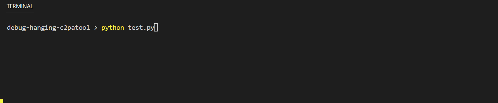
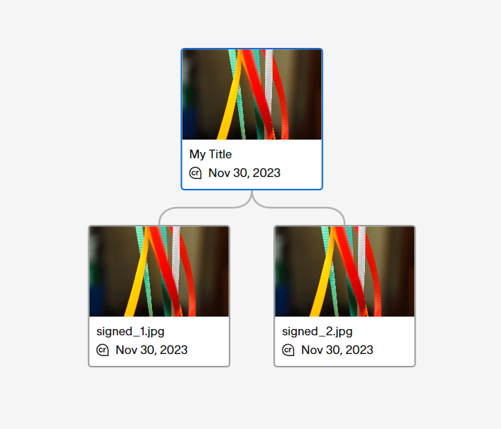

# debug-hanging-c2patool

## Issue is Solved

The problem has nothing to do with `c2patool`, I was just incorrectly discarding the `stdout` when
calling it via Python's `subprocess.call()`.

```py
# really bad, not sure where I got this from
subprocess.check_call(cmd, stdout=-1)

# correct and works
subprocess.check_call(cmd, stdout=subprocess.DEVNULL)
```

Only after reading this [StackOverflow answer](https://stackoverflow.com/a/4527503/7317517), I
picked up that I incorrectly discarded the output.

The `subprocess.call()` function even has a warning related to this (I think) in the official
[documentation](https://docs.python.org/3/library/subprocess.html#subprocess.call)

> **Note:** Do not use `stdout=PIPE` or `stderr=PIPE` with this function. The child process will
> block if it generates enough output to a pipe to fill up the OS pipe buffer as the pipes are not
> being read from.

## System Setup

This repository contains the reproduction steps to get the `c2patool` to hang when combining
multiple ingredients into a single asset.

I could reproduce this issue reliably under the following conditions
  - `c2patool` 0.6.2 or 0.7.0
  - Windows 11 only, no sign of this problem under Ubuntu
  - Only when calling the `c2patool` via Python (tested 3.11.4 and 3.9.12) with `stdout` redirected

On my Windows system, running the accompanying `test.py` script with `python test.py` reliably
produces the bug where the `c2patool` hangs on the last command.



To reiterate, this problem does not occur when either
  - running under Linux (tested with Ubuntu 22.04.03)
  - running the last command outside normally via the terminal
  - not redirecting stdout (removing the `stdout=-1` in `call_with_print()`)

At this moment I have not looked into other ways of reproducing this problem, so it is still
possible that it is triggered by a problem in Python or on my system.

## c2patool Operations

The script performs the following operations

  1. Sign `c2pa_sample/image.jpg` and create an ingredient from it
  2. Sign `c2pa_sample/image.jpg` a second time and create a second ingredient
  3. Sign `c2pa_sample/image.jpg` a third time, this time with both ingredients as `componentOf`

The generated asset (which is written out even when the tool hangs afterwards), looks like this on
https://contentcredentials.org/verify:



## Reproduction

In the root of this repository, run

```
python test.py
```

